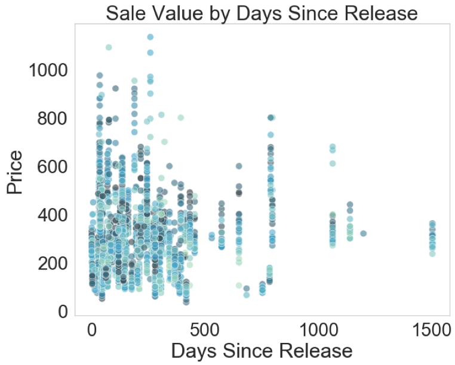
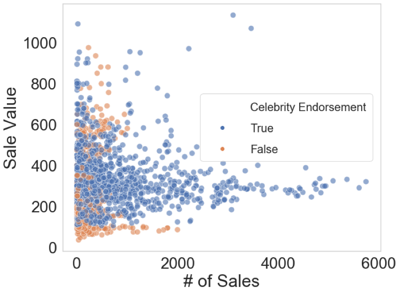
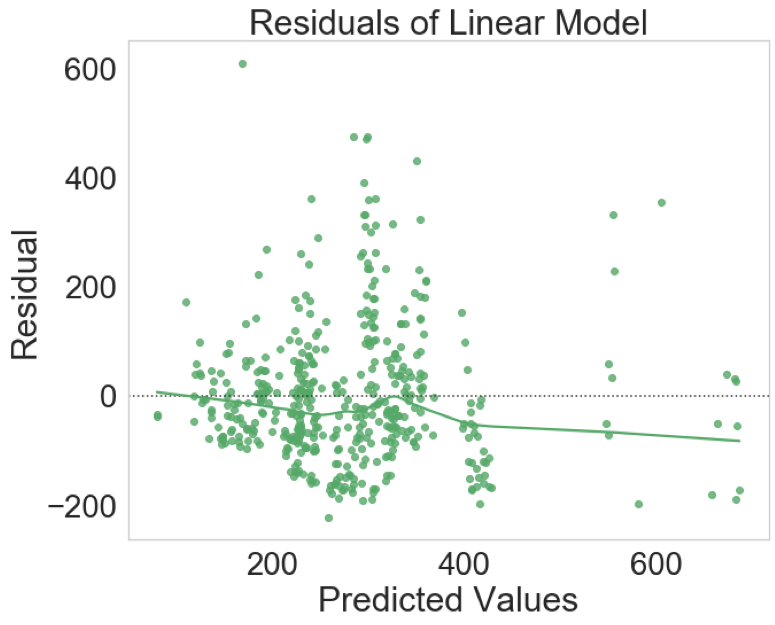
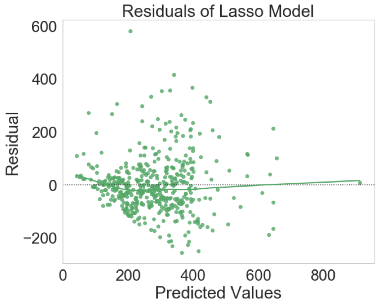

# StockX Regression Project
StockX.com is a website where sellers can resell exotic/limited quantity shoes. Many of these shoes sell for much higher than their initial retail price. StockX operates much like a stock market exchange with bid and ask prices displayed.

# Motivation
In this investigation, I collect StockX.com shoe data such as initial retail price, release date of shoe, brand, shoe size, number of sales, etc (independent variables) to predict the last sale price (dependent variable). I chose the last sale price rather than the bid or ask prices because it is a better replication of the true value of the shoe. For instance, some shoes with large bid/ask spreads have asks that are too high to actually be sold. Some independent variables such as shoe size are critical to collect due to the price varying based on the supply/demand of that shoe size. More information can be found: https://stockx.com/news/the-stockx-data-guide-to-resale/ 

# Webscraping
Utilizing the requests and BeautifulSoup library, I was able to scrape and parse 2863 StockX.com listings. I was able to collect key features such as size, release date, retail price, number of sales, brand, color, etc.

# Data Cleaning and Feature Engineering
I removed certain shoe sizes that were too sparse in my data and considered children shoe sizes to be one combined size. Then I used each shoe size as a dummy variable (meaning a variable that is coded as 0 or 1 depending if the observation is that category). I also was able to extract whether the shoe was celebrity enddorsed from the name of the shoe. Release date was changed to days since release to work with the regression models. I removed shoes with too high of a premium as they could potentially skew the model.

# Modeling
After splitting the data into training and test sets, I initially attempted to model with a simple linear regression, which was not capturing the higher last sale prices. In order to counteract this, I generated polynomial features with the independent variables and ran a LASSO model on these variables with an alpha of 0.01. This is the regularization strength that allows the model to select the more relevant features based on a cost function. Using the polynomial features with a LASSO model, I was able to improve the explained variance in my model without overfitting. Lastly I built a Random Forest which had the best performance of the models at the cost of losing some interpretability.

## Linear Model Residuals

## LASSO Model Residuals

